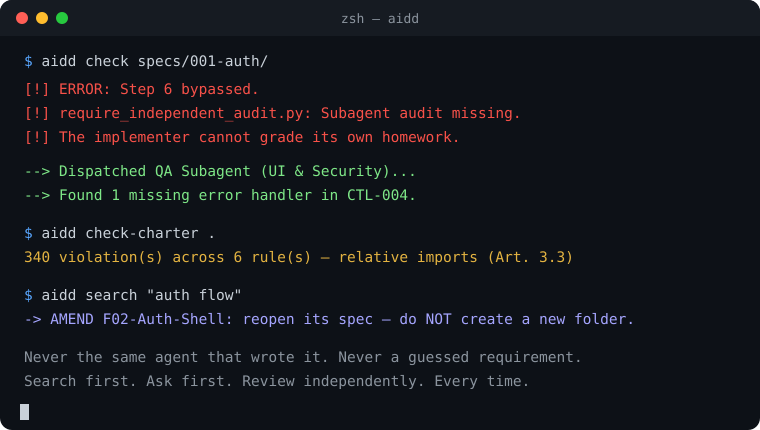

<div align="center">

# ⚡ AIDD — AI-Driven Development
### Stop AI coding agents from grading their own homework.

[](https://pypi.org/project/aidd-cli/)
[](LICENSE)
[](https://www.python.org/)
[](https://claude.ai)
[](https://github.com/sponsors/quimhen)

**A methodology with technical teeth for AI coding agents (Claude Code, OpenCode, Codex, Gemini CLI).**
It forces agents to search before creating, plan out loud before coding, and blocks self-approval
via automated hooks — not another AI coding agent itself, a set of habits your existing one follows.

[Explore Landing](https://aidd-landing.vercel.app/) · [Why AIDD](docs/WHY-AIDD.md) · [Pipeline Docs](docs/PIPELINE.md) · [Report Bug](https://github.com/quimhen/aidd/issues)

</div>

---

### 🚀 10-Second Quick Start

Get started in any existing repository without modifying your code:

```bash
# 1. Install the CLI
pip install aidd-cli

# 2. Initialize in your project
aidd init .

# 3. Check for architectural violations & spec gaps
aidd check-charter .
aidd search "auth flow"
```

> **Using Claude Code?** Install the technical enforcement gates with one command:
> ```bash
> cp -r skill ~/.claude/skills/aidd && python ~/.claude/skills/aidd/scripts/install_hooks.py
> ```

<div align="center">
  
</div>

---

### ⚖️ Why AIDD vs. traditional prompts / spec files

| Feature | Traditional rules (`CLAUDE.md`, `.cursorrules`) | AIDD methodology |
| :--- | :--- | :--- |
| **Compliance** | Optional (LLMs tend to skip long instructions) | **Strict / blocking** (real system hooks) |
| **Code review** | The same agent grades its own code | **Independent subagent audit, mandatory** |
| **UI mapping** | Duplicated, per-screen prose | **Unified codes** (`COMP-nnn`, `CTL-nnn`) |
| **Task tracking** | Disconnected markdown nobody re-checks | **Bidirectional sync** with GitHub / Azure DevOps / Bitbucket |
| **Context cost** | Dumps thousands of tokens into every prompt | **Indexed local lookup** (`find_spec.py`) |

## The problem

AI coding agents are fast at writing code and bad at knowing what already exists. Left alone, they
duplicate specs nobody asked for, re-explain a flow in three paragraphs instead of drawing it, ship
a fix that fabricates success instead of actually calling the real backend, and grade their own
homework when asked to review it. AIDD is the set of habits that stops that — enforced by hooks
where the tool allows it, followed as a written discipline everywhere else.

## What it does

- **Searches before creating.** Every request runs against a compact, auto-built graph of every
  existing spec (`specs/index.toon`) before anything new gets created — a match means "amend this,"
  not "start over."
- **Shows the plan before building it.** Step 1.5 turns each use case into an interactive
  actors × processes flow with generated pseudocode (`aidd flow specs/001-login/visual-flow.toon
  --open`) — the user clicks through it and corrects the flow by node, not in prose. Source is
  a compact TOON file; layout, routing and pseudocode are derived, never hand-drawn.
- **Plans out loud.** Ambiguity gets resolved as an explicit question before code is written, not
  discovered after a review.
- **Ships in small, reviewable pieces.** One code, one file, one PR — a wrong pass costs one edit,
  not a rewrite.
- **Never lets the implementer grade its own work.** Step 6's review must come from a separate
  agent dispatch, one per domain the change touched. On Claude Code this is an actual technical
  gate (`hooks/rule_gate.py` + `stop_gate.py`), not just a rule stated in a doc.
- **Enforces the rules instead of asking nicely.** Hard rules R1–R12: estimates are agent
  minutes per wave (human hours only as a reference), skipping a step needs the user's quoted
  confirmation (verified against what the user typed or answered), the agent can't answer its own
  Align questions (blank answers block planning, `repo —` sources must exist and cite a line),
  plan/tasks can't be written out of order, `tasks.md` approval is the user's recorded "Approve"
  answer plus a tamper-evident hash, a spec stays open until `aidd rules close`/`abandon` (touching
  another spec can't switch the gates off), code edits are blocked for every open spec without a
  recorded approval, every required domain needs its own distinct auditor, and a session can't
  end on built code without its closing audits (R8 relaxes after 3 blocks); a ✅ screen/API/field
  needs executed evidence, not a code reading (R10, freshness best-effort), a repeated bug needs a
  root cause and pattern sweep (R11), and a task that reuses a screen/component must say whether it is a
  new view or logic only (R12). Hooks write an
  append-only evidence log (guarded against the agent by R9: the Write/Edit tools and a lexical shell guard, not a sandbox) (per-session in the temp dir, plus a project log only where
  a `specs/` or `.aidd/` root exists) that the gates read; `aidd status` lists every open spec with the
  ledger and **WHY blocked**, and `aidd rules check` prints `PASS|FAIL Rn … → fix`.
  Honest limits: Claude Code only; **Bash and PowerShell can still edit code** and, through the CLI or
  libraries, try to forge evidence (the guard is lexical, not a sandbox); the gates check that a
  subagent ran and a question was answered, not that they were good; the user's click cannot be
  proven; hooks fail open on a crash, launch failure or timeout (recorded as `hook_error` when
  possible); session ids/resume behaviour are not verified. The rules stop accidental and
  self-justified skipping, not a determined agent. `AIDD_RULES=off|0|false|no|warn` is the
  owner's escape hatch.
- **Remembers the why.** Decisions, rejected options, bug root causes and constraints go into
  `.aidd/memory/` as curated, code-anchored AIDD-TOON entries, committed with the code — no
  daemon, no LLM observer, no vectors, stdlib only. Search is progressive: `aidd mem search`
  returns one line per hit, `aidd mem show <id>` the full row. On Claude Code `memory_context.py` surfaces
  the relevant entries at session start (installed by default; the per-file `memory_file_context.py` is opt-in). `STATE.md` stays
  "where am I", `specs/index.toon` stays "what exists"; memory is "why". A one-off, read-only
  importer can seed it from a claude-mem database (secrets and IPs scrubbed). Memory is committed content that gets injected into sessions: review it like code.
- **Works the same across tools.** One methodology (`skill/AIDD.md`), thin adapters per tool — no
  relearning the process when the assistant changes. For Claude Code, OpenCode, and Codex, that's
  a native skill/AGENTS.md pointer; for Gemini CLI, Cursor, Windsurf, Cline, and GitHub Copilot,
  `generate_adapters.py` renders each one's own native command-file format straight from
  `commands/aidd-*.md` — one source, no per-agent copy to keep in sync. Both the issue-tracker
  providers and these adapter targets are auto-discovered extensions (see
  [`docs/EXTENDING.md`](docs/EXTENDING.md)), so a project can add its own without forking this repo.
- **Has a charter that's actually checked.** Project-wide rules split into judgment calls
  (prose) and checkable ones (a pattern + glob table `check_charter.py` runs for real) — not
  a principles doc trusted to memory. Run against a real production project, it caught two
  stale claims in that project's own hand-written notes about specific libraries being unused
  (both false, verified in seconds) and a third that turned out far worse than self-rated
  (340 real violations of a rule logged as low-severity).
- **Verifies its own map before planning against it.** The spec graph is parsed mechanically
  (fast, cheap), which also means it can misparse a renamed code or a stale relationship — so a
  rebuild dispatches an independent Graph Coherence Auditor before `plan.md`/`tasks.md` build on
  the new edges. Enforced by a hook pair, not a step an agent could skip under time pressure.
- **Syncs to GitHub, Azure DevOps, or Bitbucket — not just markdown.** An approved `tasks.md`
  becomes real, trackable issues via `tasks_to_issues.py --provider {github,azure_devops,
  bitbucket}` — dry-run by default, never duplicates on re-run. It stays in sync from there:
  `aidd tracker sync` diffs (or writes, with `--apply`) `tasks.md`'s Status column against live
  tracker status, and `aidd tracker link-pr` attaches an opened PR's URL back to its task's
  tracker issue and `tasks.md` row. CI templates for both trackers ship under
  `skill/templates/ci/`, installed with `aidd ci install {github,azure-devops}`.
- **Has a package-install mechanism, kept to the load-bearing parts — not yet a third-party
  ecosystem.** `catalog/` is the marketplace *mechanism*: packages (templates, agent adapters,
  issue-tracker providers, hooks) install into *your* project with `aidd marketplace install
  <id>`, content-hashed so `remove` never discards a file you hand-edited since. A
  `provider`/`adapter`/`hook` package lands under `.aidd/extensions/<id>/` and is
  auto-discovered from there — no code change to this repo needed to use it. Structural
  validation runs in CI on every submission; a maintainer still reviews and merges each one by
  hand — see `catalog/README.md`. Today that catalog holds exactly one package, first-party
  (`hotfix-report`); zero third-party submissions have been merged yet — the mechanism is built
  and tested, the ecosystem it's built for doesn't exist yet. Manage what's discovered
  (first-party or project-local) with `aidd extensions list|info <id>|enable <id>|disable <id>`
  — see [`docs/EXTENDING.md`](docs/EXTENDING.md).

## What's in this repo

- **`skill/`** — the Claude Code skill: `SKILL.md`, enforcement hooks (`hooks/`: ten by default, centred on the single `rule_gate.py`), and every
  script/template (`scripts/`, `templates/`). `skill/AIDD.md` is the tool-agnostic methodology
  core every other adapter — including this repo's own CLI — points back to. Includes AIDD Memory
  (`scripts/aidd_memory.py`, `aidd_memory_import.py`; hooks `memory_context.py`,
  `memory_file_context.py`, opt-in via `install_hooks.py --with-memory-file-hook`).
- **`aidd/`** — the CLI (`pip install -e .` → the `aidd` command): a thin dispatcher over
  `skill/scripts/`, for a human at a terminal or a CI job, no AI agent required.
- **`commands/`** — the eight `/aidd-*` pipeline-stage commands for Claude Code.
- **`adapters/`** — drop-in adapters for other agent tools (OpenCode skill + plugin, an
  `AGENTS.md` snippet for Codex and others, a `GEMINI.md` pointer) plus `dot-aidd/`, the portable
  `.aidd/` bundle (methodology + scripts + templates, no Claude-specific pieces) any project
  installs once and every adapter reads from. See `adapters/README.md` for the install steps.
- **`catalog/`** — the marketplace mechanism: `schema.json`, two registries (`catalog.json`
  first-party, currently one package; `catalog.community.json` third-party, currently empty),
  and `packages/<id>/` folders. Installed/searched via `skill/scripts/marketplace.py` (or `aidd
  marketplace ...`), validated in CI by `skill/scripts/validate_catalog_entry.py`. See
  `catalog/README.md` and `catalog/CONTRIBUTING.md`.
- **`tests/`** — the stdlib `unittest` suite (zero dependencies, `python -m unittest discover -s
  tests`), run on every push/PR by `.github/workflows/test.yml` (and `catalog-validate.yml` for
  anything touching `catalog/`).

## Install (Claude Code)

```bash
cp -r skill ~/.claude/skills/aidd
python ~/.claude/skills/aidd/scripts/install_hooks.py
```

## Install (the CLI — for a terminal or CI, no AI agent needed)

```bash
pip install aidd-cli
aidd init /path/to/your/project   # installs the .aidd/ bundle there
aidd search "login"               # search the spec graph
aidd check specs/001-login/       # mechanical gap-check
aidd check-charter .         # run charter.md's checkable rules
aidd status                       # hard-rules ledger of all open specs + WHY blocked (--json; exit 0 always)
aidd rules check specs/001-login/ # PASS|FAIL Rn message -> fix (exit 1 on a violation)
aidd rules approve specs/001-login/   # write the tasks.md Approved: line (needs the user's recorded "Approve" answer)
aidd rules close 001-login        # complete the spec (needs approval + qa-audit + auditors + the user's "Yes, close" answer)
aidd rules abandon 001-login      # drop it (needs the user's recorded "Abandon" answer)
aidd flow specs/001-login/visual-flow.toon --open   # Flowmap: interactive flow + pseudocode
aidd mem add --type decision --title "Login uses magic links" --why "No password storage" --codes US-001,API-003 --scope 001-login
aidd mem search login                              # one line per hit: id, date, type, codes, title
aidd mem show m-3fa91c02                           # full entry (why, files, supersedes)
aidd mem timeline m-3fa91c02                       # neighbouring entries of the same scope, by date
aidd mem file skill/scripts/flowmap.py             # entries that mention a file
aidd mem inject                                    # the digest the SessionStart hook injects (also: inject --file PATH)
aidd mem stats                                     # counts by type/scope, bytes
aidd mem compact --before 2026-07-01 --apply       # archive superseded/old entries (dry run without --apply)
aidd mem import-claude-mem <claude-mem.db> --project myproj --since 2026-01-01 --dry-run   # one-off, read-only import (also --scope, --include, --no-summaries)
# AIDD_MEMORY_DIR overrides .aidd/memory/; `aidd mem --root X <cmd>` works before or after the command; `add --date` backdates
aidd tasks-to-issues specs/001-login/tasks.md --apply   # sync tasks (github by default)
aidd tasks-to-issues specs/001-login/tasks.md --provider azure_devops --org ... --project ... --apply
aidd adapters generate all /path/to/your/project   # native commands for Gemini CLI, Cursor, Windsurf, Cline, Copilot
aidd marketplace list                              # browse installable third-party packages
aidd marketplace install hotfix-report /path/to/your/project
aidd extensions list                               # discovered provider/adapter/hook extensions
aidd tracker sync specs/001-login/tasks.md --provider github --repo owner/repo   # dry-run status diff
aidd tracker link-pr specs/001-login/tasks.md --pr-url ... --branch ... --apply
aidd ci install github /path/to/your/project       # install the GitHub Actions CI template
```

Published on PyPI as [`aidd-cli`](https://pypi.org/project/aidd-cli/). To work on AIDD itself
instead of just using it, clone and install in editable mode:

```bash
git clone https://github.com/quimhen/aidd.git && cd aidd
pip install -e .
```

## Install (other tools)

See `adapters/README.md`.

## Documentation

- [**Why AIDD**](docs/WHY-AIDD.md) — what changes for you, in plain language, with the measured
  numbers.
- [**Pipeline reference**](docs/PIPELINE.md) — the full technical breakdown: the code system, the
  spec graph, every step, the enforcement hooks.
- [**FAQ**](docs/FAQ.md) — common questions. Have one that's not there? Open an
  [issue](../../issues) or a [discussion](../../discussions).
- [**Extending AIDD**](docs/EXTENDING.md) — the three extension seams (issue tracker
  providers and multi-agent adapter targets, both auto-discovered from
  `skill/extensions/**/manifest.json` or `.aidd/extensions/**/manifest.json`, plus
  charter checkable rules), and how they relate to the marketplace (`catalog/`).
- [**Consulting**](docs/CONSULTING.md) — if your team wants help adopting AIDD.

## Status

Early — the core pipeline, the search/graph tools, the charter checker, the graph-coherence
gate, the issue-tracker sync (GitHub/Azure DevOps/Bitbucket, plus bidirectional status sync
via `aidd tracker sync` and PR<->task linking via `aidd tracker link-pr`), CI templates and
`aidd ci install`, the Claude Code hooks (ten by default, plus an opt-in per-file memory hook; one `rule_gate.py` enforcing hard rules R1–R12
including the independent-audit and graph-coherence gates, and a `stop_gate.py`), the evidence log, `aidd status`/`aidd rules`, the multi-agent adapter generator (`generate_adapters.py`, rendering
Gemini CLI/Cursor/Windsurf/Cline/Copilot commands from one source), the real auto-discovery
extension registry (`extension_registry.py`, loading provider/adapter/hook extensions from
`skill/extensions/**/manifest.json` and `.aidd/extensions/**/manifest.json` — see
`docs/EXTENDING.md`), and the marketplace (`catalog/` + `marketplace.py` +
`validate_catalog_entry.py`, one first-party package shipped so far: `hotfix-report`) are built,
tested (stdlib `unittest`, run in CI), and have been run against a real production
codebase. OpenCode, Codex, and the five generated adapter targets follow the same methodology;
only the Claude Code hooks currently give it technical teeth. Published on PyPI as `aidd-cli`.
The marketplace is intentionally not a fully automated accept path: CI validates structure and
flags anything worth a human's attention, but a maintainer reviews and merges every catalog
submission by hand — see `catalog/README.md`.

## Support this project

If AIDD saves your agent sessions real time, [sponsor it on GitHub](https://github.com/sponsors/quimhen)
— it funds the time spent maintaining the pipeline, the hooks, and the multi-agent adapters.

## License

MIT — see [LICENSE](LICENSE).
