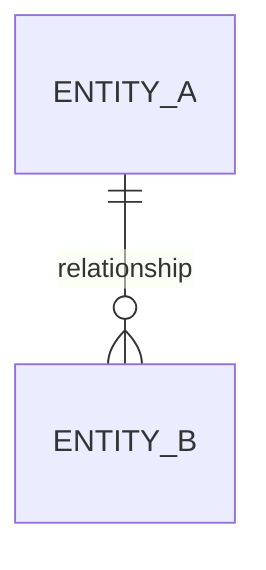

# Data Model — [feature name]

Only for features that add or change persisted data. Skip this file entirely otherwise.

## Entities (logical)

| Entity | Field | Type | Required | Notes |
|---|---|---|---|---|
| | | | | |

## Entity → Table/Column mapping (the exact thing code reads/writes)

This is not optional alongside the ER diagram below — the diagram shows the shape, this table
shows the exact table/column/key code actually depends on.

| Entity | Table | Column | DB type | Key (PK/FK → target) | Engine/DB instance |
|---|---|---|---|---|---|
| | | | | | |

## Relationships

Every entity above needs a row here connecting it to at least one other entity, OR an explicit
note that it's isolated by design. No entity should be silently missing from this diagram.

## Connections & transactions
[Skip this section for a BaaS/serverless DB (Supabase, Firebase, PlanetScale, Neon) — use "RLS & session" below instead.]

| Item | Value |
|---|---|
| Connection strategy | pool (default) \| manual open/close (exception — reason: ___) |
| Connection health check before use | [e.g. `SELECT 1` ping, or pool's built-in health check] |
| Transaction boundaries | [which operations are wrapped in one transaction, and where the rollback path is exercised] |

## RLS & session (Supabase/Postgres-with-RLS and similar — skip if this DB doesn't have RLS)

No table below "no policy" by omission — every table this feature touches gets a row, even if the
row just says "public read, no write."

| Table | Operation | Policy name | Condition/role it checks |
|---|---|---|---|
| | select | | |
| | insert | | |
| | update | | |
| | delete | | |

| Item | Value |
|---|---|
| Client SDK instance | one shared instance app-wide — not created per request/component |
| Session/token refresh | [how and when the session is validated/refreshed before a dependent operation] |
| Realtime subscriptions used? | if yes: reconnect/backoff on drop + explicit unsubscribe on unmount, both present |

## Migration notes
[What changes to existing tables/collections this requires, and what happens to existing rows. For a BaaS DB, cite the actual migration file — the mapping above is only as good as its match to it.]
