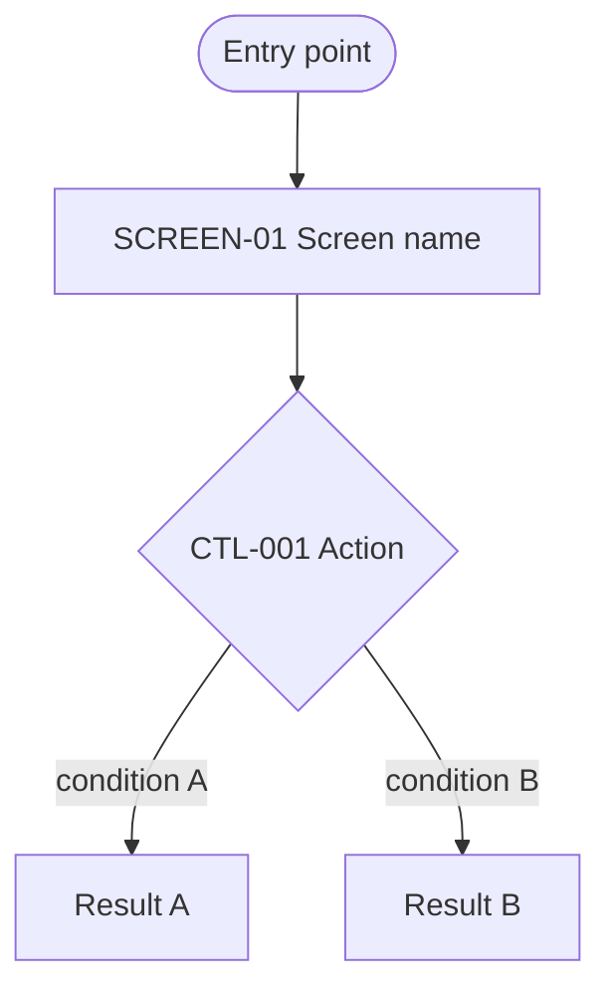
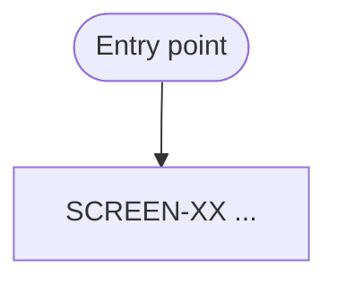

# Visual Flow — [feature name]

One Mermaid flowchart per US-nnn. Every node cites its SCREEN-XX/CTL-nnn code — never a redescription.
This file is the artifact used for interactive correction in Align: edit the diagram, don't describe the fix in prose.

## US-001 — [use case description]

Status: [Explicit | draft pending user confirmation]

## US-002 — [use case description]

Status: [Explicit | draft pending user confirmation]
