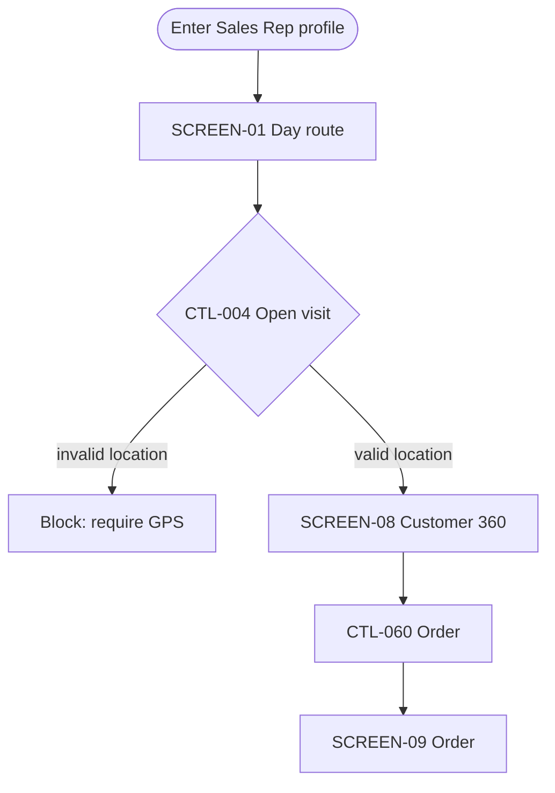

# AI-Driven Development, one small PR at a time

AIDD is the default pipeline for any change to a codebase — UI or backend-only, a new feature or a
one-line fix — not a UI-specific tool. On every requirement it classifies itself first (new spec,
amendment, or a fast-lane fix) against a searchable graph of every existing spec, then turns the
work into stable codes, a Mermaid flowchart you correct instead of describe, a task list detailed
with a classify/estimate/decompose/assign rubric, and a per-PR done-checklist audited by an
independent pass. Self-contained: no other skill required.

> **Why it exists.** A palette fixed for 3 pilot screens, then 41 more built before the mismatch
> was caught. A mockup-parity effort that took three audit rounds (97% → 98.7% → 100%) to close,
> because gaps were found by auditing *after* building. A small fix that spawned its own
> disconnected spec folder because nothing checked whether one already existed.
>
> The fix: front-load 100% of the visual truth into codes before any task exists, always search
> the existing spec graph before opening a new one, keep every PR small, and gate "done" on four
> things together — not "looks right."

## Run it

Invoke the skill directly, or reach for one of its eight pipeline-stage commands — each one jumps
straight to that step instead of re-explaining the whole flow:

| Command | Step |
|---|---|
| `/aidd-scope` | −1/0 — search existing specs, pin the visual source of truth |
| `/aidd-audit` | 1/1.5 — mockup audit + visual process flow |
| `/aidd-align` | 2 — resolve ambiguity before planning |
| `/aidd-plan` | 3 — the Screen → Code map |
| `/aidd-tasks` | 4 — break the plan into small-PR tasks |
| `/aidd-build` | 5 — implement one gated PR at a time |
| `/aidd-converge` | 6 — independent, specialized audit |
| `/aidd-doc` | 7 — comprehensive handoff documentation |

Or say nothing special at all: any message that reads like a requirement, change, improvement, or
fix — in English, Spanish, Portuguese, or a handful of literal Chinese trigger terms — engages
AIDD automatically. See [Enforcement hooks](#enforcement-hooks-installed-once-active-every-session)
below.

## The code system

Assigned the moment the mockup is first read. Never renamed. Every later artifact — spec, task,
code comment, checklist — cites the code instead of redescribing the UI.

| Code | Grain | Example |
|---|---|---|
| `SCREEN-XX` | One screen / view / modal | `SCREEN-08` = "Client detail sheet" |
| `SCREEN-XX-Fnn` | One testable behavior of that screen | `SCREEN-08-F03` = "Blocks save when required field is empty" |
| `CTL-nnn` | One control, globally numbered | `CTL-057` = the "Save" button |
| `COMP-nnn` | One reusable component — 2+ screens, like a component design tool | `COMP-003` = "ClientCard" (used on SCREEN-02 and SCREEN-08) |
| `US-nnn` | The use case the screen serves | `US-004` = "Sales rep logs a new order" |
| `API-nnn` | One backend endpoint/contract (full-stack) | `API-012` = `POST /orders` |

**Components close the "rebuilt per screen" gap** — the same card, header, or form appearing on
several screens is built once as a `COMP-nnn` and referenced by every `SCREEN-XX` that uses it, the
same way a component-based design canvas assembles a screen from a library instead of drawing it
from scratch. Full-stack link: a `CTL-nnn` that triggers a network call cites the `API-nnn` it
depends on, and `contracts.md` cites the `CTL-nnn` back — a backend change's blast radius on the UI
becomes a lookup, not a grep.

## Step −1 — Intake: classify before creating

Every requirement, change, modification, update, fix, or improvement request goes through intake
first — before Step 0, before any file is touched. The job is to turn "the user asked for
something" into one of three concrete classifications, from evidence, and say which one out loud
before proceeding.

| Language pattern | Suggests |
|---|---|
| "create", "new screen/module/feature", "something that doesn't exist yet" | New spec |
| "modify", "update", "change", "improve", "add to", "extend" | Amendment to an existing spec |
| "correct", "fix", "doesn't work", "bug", "error in" | Amendment (fix), likely Fast Lane |

That table only pre-loads a hypothesis — wording alone isn't proof. The spec graph search below is
what actually confirms or overturns it.

> **AIDD intake:** `[NEW SPEC | AMENDMENT | AMENDMENT — Fast Lane]` — one-line reason citing the
> search result. Proceeding to the next step.

Decision rule: a match in the spec graph is always an **amendment**, regardless of what the
request's wording suggested — reopen the top-ranked spec, append new codes, never renumber ones
already assigned. If it also meets the Fast Lane conditions (one existing screen, no new use case,
no new component, no navigation change), it's a single task with no full-pipeline ceremony. No
match at all is a **new spec** — justified only when there's genuinely no existing spec covering
the area. A low or ambiguous score is never decided silently: it becomes a question back to the
user.

## The spec graph

Every project accumulates a `specs/index.toon` — a compact tabular index, not JSON, rebuilt
automatically whenever a spec's files change (checked by file `mtime`, no content re-read unless
something actually changed). It holds two things per spec: a searchable set of codes/keywords, and
the spec's real dependency graph, parsed straight from `mockup-audit.md`'s own tables — nothing
re-derived or guessed.

```
$ python scripts/find_spec.py --tree 001-login
001-login — Login & session
  - US-001
    - SCREEN-01
      - COMP-001
        - CTL-001
          - API-001
        - CTL-002
```

A shared `COMP-nnn` correctly appears under every screen that uses it — this is a DAG, not a flat
tree, matching the "build once, use everywhere" component model. A code-based search prints the
matched code's exact path through the graph ("Graph context") alongside the evidence lines — the
answer to "what does this belong to" is a lookup, not a re-read.

| Command | Does |
|---|---|
| `find_spec.py <keywords or code>` | Ranks every spec by match; exit 0 = amend the top match, exit 1 = safe to create new |
| `find_spec.py --tree <spec-id>` | Prints that spec's full use-case → screen → component → control → API graph |
| `find_spec.py --list` | Lists every spec with its title, from the index — no file reads |
| `find_spec.py --reindex` | Forces a full rebuild — an explicit escape hatch, not a normal step |

## Two failure patterns it designs against

- **Late-fixed palette** — 3 pilot screens got a palette approved, then 41 more screens were built
  before a mismatch with the real target palette surfaced — full re-migration.
- **After-the-fact auditing** — a parity effort against a mockup took 3 revision rounds to reach
  100% because gaps were discovered by auditing the finished build, not by enumerating every
  element up front.

## Speed — what actually cuts time-to-correct-result

The rest of this skill produces correctness through traceability; these five make it faster to
run, applied by default.

- **Search the spec graph before creating** — `python scripts/find_spec.py <keywords>` replaces a
  remembered grep with a mechanical, indexed lookup.
- **Run the checker before the Auditor reads by hand** —
  `python ~/.claude/skills/aidd/scripts/check_spec.py specs/[###]/` — stdlib-only, catches dangling
  codes, unresolved `[Not Verified]`, empty `PR/Spec ref`, orphaned components, missing
  stored-procedure/exception pairs, missing out-of-scope notes, blank QA statuses. Milliseconds,
  not a manual re-read. The Auditor's judgment goes only to what the script can't check.
- **Check the Component Index before minting a new `COMP-nnn`** — one project-level
  `design-system/components-index.md` listing every component ever created, across every spec — a
  lookup instead of grepping every spec folder the project has accumulated.
- **Wave-dispatch independent tasks** — tasks with no dependency between them (disjoint files, no
  ordering requirement) get dispatched as parallel agent calls **in one message**, not one at a
  time. This is where an agentic workflow actually saves wall-clock time over a linear one.
- **Take the fast lane for small changes** — one existing screen, no new use case, no new
  component, no navigation change → skip `visual-flow.md` and `comprehensive-documentation.md`,
  amend directly, one task. The full pipeline on a trivial fix is itself a time cost this skill
  exists to eliminate.

Also: when the mockup source has a connected design tool (Figma, Stitch) in the session, Step 1
populates the inventory mechanically from it instead of transcribing a screenshot by eye.

### Grep first — never read a whole file to check one code

Every code is a search key by design. Check whether one exists with `grep -n "CTL-057"
mockup-audit.md`, not a full read; use `check_spec.py`'s report as the first source of truth, not
a manual read-through. The one legitimate full read is Step 1's own audit — exhaustive once, so
everything after it can be a lookup.

**Code markers make source itself greppable:** a fixed `aidd:CODE` tag in whatever comment syntax
the language uses — `// aidd:CTL-057`, `# aidd:SCREEN-08`, `<!-- aidd:COMP-003 -->`. One grep
pattern then finds the mockup row, the plan mapping, and the exact source line together.

### STATE.md — resume without re-investigating

A fresh agent or session has no memory of what a prior one figured out. One small, always-current
file at the project root — **not per-feature** — fixes that: active spec + current step, last
action, next action, and quick pointers (grep targets, not restated content). **Read it first, in
full, before touching anything else.** Every step that changes what's true updates it with a short
edit — append-only, like the revision log, never a full rewrite.

## Templates

Every artifact has a real starting skeleton — nothing is reconstructed from memory each time.

```
~/.claude/skills/aidd/templates/
├── STATE.md                       project-root continuity, read first
├── mockup-audit.md
├── visual-flow.md
├── contracts.md                    full-stack only
├── data-model.md                   only if persisted data changes
├── research.md                     optional
├── spec.md
├── plan.md
├── tasks.md
├── qa-audit.md
├── comprehensive-documentation.md
├── design-system/
│   ├── MASTER.md                    global visual source of truth
│   ├── components-index.md         project-wide COMP-nnn registry
│   └── page-override.md            per-page exception to Master
└── ../scripts/
    ├── check_spec.py               gap-checker, run before Step 6
    └── find_spec.py                spec graph search + index, run before Step 0
```

## Specialized agents & workflow

Each step has a natural agent boundary. One rule matters more than the rest: **the Step 6 Auditor
must never be the same agent that did the implementing** — an agent that just wrote code is
structurally bad at spotting its own gaps. On Claude Code this is a real gate
(`require_independent_audit.py`, see [Enforcement hooks](#enforcement-hooks-installed-once-active-every-session)
below), not only a rule stated here.

| Step | Role | Run as | Independence |
|---|---|---|---|
| −1, 1 | Mockup Auditor | Read-only pass | — |
| 1.5 | Diagrammer | Same context, or fresh agent | — |
| 2 | Alignment Agent (drafting) | Fork/fresh agent — compiles the open-question list | — |
| 2 | Ask the user | Main conversation — the one interactive part | — |
| 3 | Mapper (drafting) | Fork/fresh agent — drafts plan.md against the real codebase | — |
| 3 | Approve the plan | Main conversation presents the draft | — |
| 4, 5 | Builder(s) | One per small-PR task | Never the Auditors below |
| 6 | Closing Auditors (QA) — one per domain | Fresh agents/contexts, one per touched domain | **Mandatory** — none implemented what it checks |
| 7 | Documenter | Mechanical assembly, any agent | — |

> **Why this makes UI validation cheap now.** Because every screen/control already carries its
> code and its `PR/Spec ref`, the Auditor's job collapses to "does the file at this ref implement
> what the code says, does its screenshot match the mockup" — a lookup per row, not a rediscovery
> of the feature.

### Scope discipline — every dispatched agent

Every agent prompt (Builder, Auditor, Diagrammer) states exactly what to do **and** exactly what
not to do — and stops instead of guessing when that isn't enough.

- **In scope** — only the codes and target file(s) the approved task names. Nothing else.
- **Out of scope** — everything else. An unrelated bug spotted along the way is a note back, never
  a bundled fix.

> **On ambiguity: stop, don't guess.** A code that doesn't resolve, a missing schema, a naming case
> the contract doesn't cover — the agent reports what's unclear and does not implement a
> "reasonable" interpretation in the meantime. Same weight as the Step 4 approval gate: a guess
> made here is indistinguishable, later, from a requirement.

## Engineering standards — restated in every agent's instructions

A fresh agent doesn't inherit these from a prior task's context, so every Builder and Auditor
prompt (Step 4 onward) carries them explicitly, every time.

- **S** — one reason to change per class/module/widget — not UI + network + validation in one name.
- **O** — extend with new code; don't bend working logic with special-case branches.
- **L** — a subtype must be usable anywhere its base is, with no surprising behavior.
- **I** — split a fat interface a consumer only partially needs.
- **D** — depend on an abstraction across any boundary — network, DB, hardware — never the concrete
  implementation directly.

> **Antifragile / Design for Failure — assume everything can fail.** Every operation crossing a
> boundary (network, DB, disk, external API, hardware) gets an explicit timeout, retry with
> backoff, and a graceful degraded path — never a blank screen.
>
> A failure that exhausts retries must leave a **traceable, recoverable record** — a dead-letter
> entry, a status field, a log with enough context to replay manually — not a caught exception
> that vanishes. Never fail silently to the user.

This isn't a fifth Definition-of-Done item — it's a property of the "Code" item in Step 5's DoD,
and the Step 6 Auditor checks failure paths too, not only happy-path fidelity to the mockup.

### One class per file, and a Naming Contract nobody has to guess

**Never bundle several classes into one file** — it makes editing unsustainable: every unrelated
change touches the same file, diffs stop being reviewable, and two tasks collide on a file that
should've been two. A task whose target file would need a second class is two tasks, not one.

| Item | Convention |
|---|---|
| Classes / components / types | PascalCase |
| Functions / variables / methods | camelCase |
| File names | the project's own convention — stated once, never defaulted |
| Classes per file | **one** |

Declared once in `plan.md`'s Naming & File Contract, before any task is written — an agent unsure
which casing applies to what stops and asks, it never picks one on its own.

### Data access & frontend↔backend communication — fixed rules

- **Stored procedures by default** — every database query goes through a stored procedure, not
  inline/ad-hoc SQL. An exception is written down in `contracts.md`, never silent.
- **API-only frontend↔backend** — the frontend never connects directly to a database or internal
  service. A `CTL-nnn` needing data cites its `API-nnn` — created first, never worked around.
- **Swagger on every API** — not "add it later." If the Swagger spec and `contracts.md` diverge,
  the Swagger spec is what gets corrected — it's what other consumers actually read.

### Database design, connections & indexing

- **Entity → Table/Column mapping** — the ER diagram shows the shape; `data-model.md`'s mapping
  table shows the exact table/column/key code reads and writes. Every entity connects to another
  or is explicitly isolated by design.
- **Database object naming contract** — tables, columns, keys, procedures, indexes, constraints,
  views — declared once in `plan.md`, same rigor as PascalCase/camelCase for code.
- **Pool connections, release in a guaranteed path** — a manual open/close per query is the
  exception, written down. Every connection is released via `finally`/`using`.
- **Validate before trusting, not after failing** — a pooled connection can be stale. Ping it
  (`SELECT 1` or the pool's health check) before the real query.
- **Explicit transaction boundaries** — begin/commit/rollback are visible in code, not implied —
  and the rollback path is exercised, not just assumed.
- **Stored procedures verified against the engine's real plan** — `EXPLAIN ANALYZE`
  (Postgres/MySQL), execution plan (SQL Server), `EXPLAIN PLAN` (Oracle). A full table scan on a
  non-tiny table is a gap, not a detail.

### Modern BaaS (Supabase, Firebase, PlanetScale, Neon) — the rules translated, plus RLS

These platforms swap "app server pools connections, calls stored procedures" for "managed client
SDK talks to an auto-generated API." Most rules above map directly; one has no traditional
equivalent:

- **RLS policies — the primary access-control layer.** A table with no explicit Row Level Security
  policy is fully open or fully locked depending on the platform default. `data-model.md` gets one
  row per table per operation — no table left implicit.
- **Stored procedure → Postgres function via RPC** — same naming contract, same `EXPLAIN ANALYZE`
  verification.
- **Connection pool → one shared client SDK instance** — the mistake to guard against is a new
  client instantiated per request/component.
- **Validate before trusting → session/token refresh** — auth sessions expire; refresh before an
  operation depends on it.
- **Realtime subscriptions need their own resilience** — reconnect with backoff on drop, explicit
  unsubscribe on unmount.

## Enforcement hooks — installed once, active every session

AIDD ships hooks so it doesn't rely on remembering to invoke it. Run `python scripts/install_hooks.py`
once per machine to merge seven entries into `~/.claude/settings.json` (idempotent, never touches
unrelated hooks already there):

| Event | Script | Effect |
|---|---|---|
| `UserPromptSubmit` | `prompt_trigger.py` | Detects change language in EN/ES/PT + literal CJK terms, runs `find_spec.py` against the message itself, and injects the Step −1 verdict inline. |
| `PreToolUse` (Write\|Edit) | `require_aidd.py` | Hard-blocks (exit 2) writing/editing source code until AIDD ran this session — exempts markdown, AIDD's own specs/design-system files. |
| `PostToolUse` (Skill) | `mark_invoked.py` | Marks AIDD invoked for this session. |
| `SessionStart` | `session_start.py` | Resets that marker for each new session. |
| `PostToolUse` (Write\|Edit) | `mark_code_edit.py` | Timestamps the most recent code-file edit this session. |
| `PostToolUse` (Task\|Agent) | `mark_agent_dispatch.py` | Timestamps the most recent independent subagent dispatch this session. |
| `PreToolUse` (Write\|Edit) | `require_independent_audit.py` | Hard-blocks (exit 2) writing/updating any `qa-audit.md` unless a subagent was dispatched *after* the last code edit — makes "the Step 6 Auditor must never be the same agent that implemented the fix" an actual gate. |

> **Why `require_independent_audit.py` exists.** This gate was added after a real session
> self-audited its own bug fix, wrote `qa-audit.md`, and moved on — nobody independent had
> actually checked it. It took a direct question ("did we really use a second agent?") to catch it
> after the fact. This hook makes that failure mode a hard stop instead of something that depends
> on someone asking. It can only verify *some* subagent ran after the last edit, not that it
> audited the right thing — raises the bar from "trivially skipped" to "requires a deliberate
> workaround," not a formal proof.

> **Language coverage.** The prompt-level nudge covers English, Spanish, Portuguese, and a handful
> of CJK terms — not every language. Even where it stays silent, AIDD still engages: the skill's
> own description is matched semantically by the model in any language, and the hard Write/Edit
> gate never reads the prompt at all.

Scope is global (every session on the machine) by design. Known gap: can't see code written
through raw `Bash` (heredocs, `sed`) — only Write/Edit.

## Pipeline

### Step −1 — Intake & search before creating

Classify the request (New spec / Amendment / Amendment — Fast Lane) against the spec graph. Never
open a new `specs/[###-feature]/` folder without running `find_spec.py` first.

### Step 0 — Establish the visual source of truth — skip entirely if there's no visual surface

A mockup exists → go to Step 1. No mockup yet, but the change touches UI → copy
`design-system/MASTER.md` once per project; add a `page-override.md` only where one screen
genuinely differs. An approved doc already exists → read Master and its override first. **No
visual surface at all** (backend, API, DB, infra, pure refactor) → skip Steps 0/1/1.5 entirely and
go straight to Step 2.

### Step 1 — Mockup Audit — mechanical, no prose

Copy `templates/mockup-audit.md`. One pass, before any task is written: Provenance, Screen
inventory, Component inventory, Control inventory, Navigation map, Behavior list per screen.

→ `specs/[###]/mockup-audit.md`

### Step 1.5 — Visual Process Flow — draw it, don't describe it

Explaining step-by-step what a user can do, in prose, is where AI interaction usually breaks down.
Copy `templates/visual-flow.md`: one Mermaid flowchart per `US-nnn`, every node labeled with its
code.



**This diagram is the interaction surface for Step 2** — correct the diagram directly ("move this
node", "this branch is missing") instead of describing the fix in words.

→ `specs/[###]/visual-flow.md`

### Step 2 — Align (Alignment Agent)

A fork/fresh agent compiles the question list first — every `[Not Verified]` row, plus every blank
row in `templates/spec.md`'s Minimum Requirements Checklist — mechanical work, no interaction
needed. Only then does the main conversation ask the user.

> **Gate.** Step 3 does not start while any Minimum Requirements row is blank.

→ `specs/[###]/spec.md`

### Step 3 — Plan: the Screen → Code map (Mapper)

A fork/fresh agent drafts this. Copy `templates/plan.md` — fill the Naming & File Contract first,
then two maps: **Screen → Code** and **Component → Code**.

Full-stack feature: also copy `templates/contracts.md`, `data-model.md`, `research.md` only if
actually needed.

→ `specs/[###]/plan.md` (+ contracts.md, data-model.md, research.md)

### Step 4 — Tasks, sized as small PRs

Copy `templates/tasks.md`. One `SCREEN-XX`, `COMP-nnn`, or `SCREEN-XX-Fnn`, one target file, one PR
— never batched. Each task detailed with a four-dimension rubric: **Classify**, **Estimate**,
**Decompose**, **Assign**.

> **Approval gate.** Present the task list as a dry-run and wait for approval before writing any
> code.

→ `specs/[###]/tasks.md`

### Step 5 — Build — one PR at a time, gated (Builder)

See the [Definition of Done](#definition-of-done--every-ui-pr) below — all four parts, every PR.

### Step 6 — Converge — one specialized Auditor per domain touched (Auditors)

Not one generic "review everything" pass. Dispatch a fresh agent per domain: **UI/Mockup**,
**Backend/API**, **Database**, **Performance & Best Practices**. Copy `templates/qa-audit.md` on
the first pass; every later pass appends.

→ `specs/[###]/qa-audit.md` updated

### Step 7 — Comprehensive Documentation (handoff) (Documenter)

Copy `templates/comprehensive-documentation.md`. Reassemble, never re-explain.

→ `specs/[###]/comprehensive-documentation.md`

## Definition of Done — every UI PR

All four, together. Not "looks right."

1. **Code** — implements exactly the codes the task cites, in exactly the target file, one class
   per file, following the Naming & File Contract, SOLID, and Antifragile/Design-for-Failure.
2. **Mapping row** — one line per code touched: ✅ IMPLEMENTED / ⚠️ PARTIAL / ❌ MISSING / 🔄
   DIFFERENT — evidence is a file/class/resource id, never a sentence.
3. **PR/Spec ref written back** — as soon as the PR exists, write it into the `PR/Spec ref` column
   of every code it touches. Append on amendment — never overwrite an earlier PR's ref.
4. **Screenshot diff** — run/build, screenshot the changed screen, compare against the mockup — per
   PR, not batched at the end.

## Convergence log

Each close-out pass appends a line; nothing is overwritten:

```
Rev 3 (2026-09-29) — 100.0% (312/312) — Δ vs Rev 2: +4 (login gradient, catalog stepper, toast component)
Rev 2 (2026-09-20) — 98.7% (308/312) — Δ vs Rev 1: +4
Rev 1 (2026-09-19) — 97.4% (304/312)
```

## File structure

```
specs/
├── index.toon            auto-built spec graph
└── [###-feature-name]/
    ├── mockup-audit.md
    ├── visual-flow.md
    ├── contracts.md      full-stack only
    ├── data-model.md     if data changes
    ├── research.md       optional
    ├── spec.md
    ├── plan.md
    ├── tasks.md
    ├── qa-audit.md
    └── comprehensive-documentation.md

design-system/             project-level, not per-feature
├── MASTER.md
└── pages/
    └── <page>.md
```

If the project already has its own spec-management convention, these files sit inside it as the
UI-specific layer — never force a folder structure the project doesn't use.

## When to reach for it

- **Default: any change to this codebase, of any size, UI or not.** A backend-only fix, a new
  endpoint, a schema migration, or a one-line config change goes through AIDD too, via the fast
  lane if it's genuinely small.
- A feature has a visual mockup (HTML, Figma, Stitch, screenshot, wireframe) that code must match.
- UI work needs breaking into small, individually-verifiable PRs instead of one big pass.
- A prior UI deliverable took several corrective rounds and the next one shouldn't.
- Reviewing a screen should mean "look up the code, open the file" — not a search.
- Explaining a flow in words takes many messages and still comes out wrong — correct a diagram
  instead.
- A feature needs a formal handoff document, not just files in a repo.
- The feature is full-stack — UI controls and the API contracts they depend on should be
  traceable to each other.
- The same card, header, or form section shows up on multiple screens and should be built once,
  not rebuilt per screen.
- The request arrives in English, Spanish, or Portuguese — coverage isn't limited to one language.
